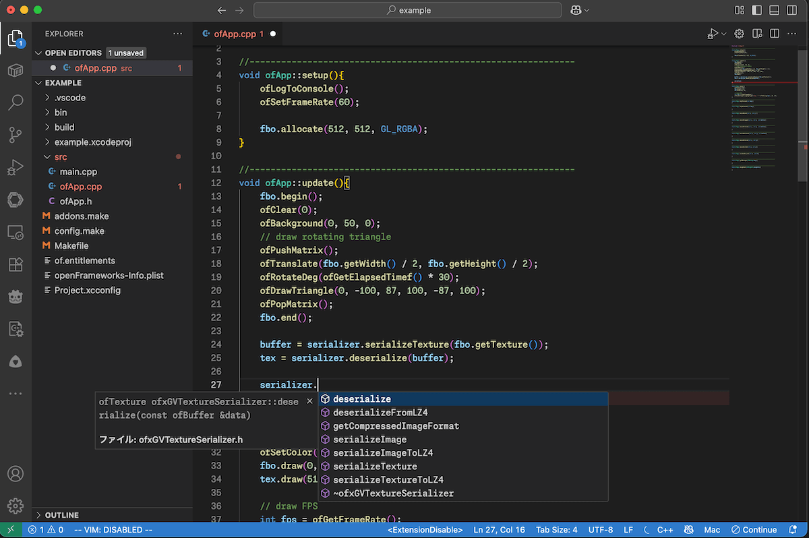
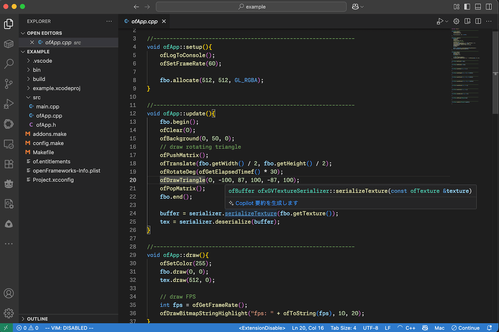

# openFrameworks VSCode Project Generator (for static analysis only)

[](https://crates.io/crates/of-vscode-project-generator-rs)
[](https://docs.rs/of-vscode-project-generator-rs)
[](LICENSE)

Code suggestion            |  Static analysis (and AI etc...)
:-------------------------:|:-------------------------:
  |  

***NOTE***: This tool is NOT official one of openFrameworks.

openFrameworks project generator for Visual Studio Code. (Rust ported from [bash version](https://github.com/funatsufumiya/of-vscode-project-generator))

(only for static code analysis like syntax-highlighting, definition jumping or intellisense. Not for building or debug.)

## Usage

NOTE: You first need to generate project using default projectGenerator.

```bash
$ cd /path/to/your/openFrameworks/apps/myApps
$ cd your_project
$ of-vscode-project-generator-rs .
```

## Install

```bash
$ cargo install of-vscode-project-generator-rs
```

or nightly (directly from github):

```bash
$ git clone https://github.com/funatsufumiya/of-vscode-project-generator-rs
$ cd of-vscode-project-generator-rs
$ cargo install --path .
```

and you also need to install [C/C++ for Visual Studio Code](https://marketplace.visualstudio.com/items?itemName=ms-vscode.cpptools).

## Uninstall

```bash
$ cargo uninstall of-vscode-project-generator-rs
```

## Limitations

- This tool loads some part of each `addon_config.mk` incompletedly (and not load `config.make`). If you need more, please modify `.vscode/c_cpp_properties.json` manually after running this script (or make PR).
- This tool exports environment-dependent settings. So you should not include `.vscode` directory in your git repository.

## Note

Code port from bash into Rust is mainly done by GitHub Copilot.<br>
Already tested well, but use with care.

## License

WTFPL or 0BSD
